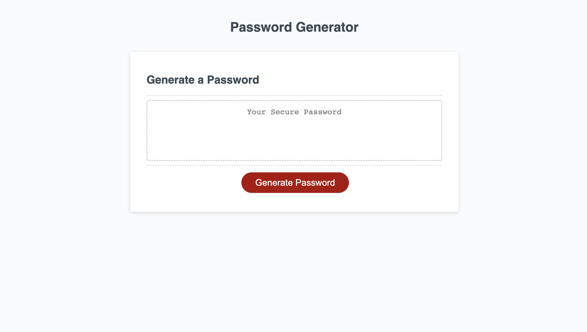

# Coding Bootcamp Week 3 Challenge

## Description

This challenge focused on creating the code for a password generator webpage. The code used to generate a password was JavaScript 

## Usage

To access this webpage, follow the link below and view the webpage, click the "Generate Password" button and follow the prompts to generate a password.

## Link

Below is the link to the webpage

https://github.com/brodie02/bootcamp-challenge3
      
---
